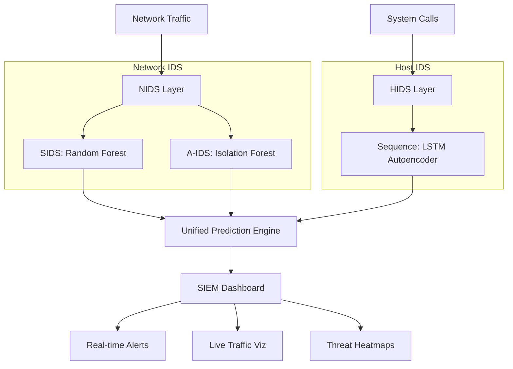

# 🛡️ Hybrid IDS - SIEM Security Platform

**Final Year B.Tech Project | CSE - Cybersecurity**  
**Central University of Jammu**

[](LICENSE)
[](https://www.python.org/)
[](https://dash.plotly.com/)
[](https://www.tensorflow.org/)

> **Author:** Syed Misbah Uddin  
> **Project:** Hybrid Intrusion Detection System with Machine Learning  
> **Status:** ✅ SIEM Upgrade Complete

---

## 📖 Project Overview

This project implements a **professional SIEM (Security Information and Event Management)** platform powered by a hybrid machine learning architecture. It combines network and host-based intrusion detection with a high-performance, real-time dashboard.

### Key Innovation: Dual-Layer ML + SIEM Visualization



---

## 🎯 Features

### 🖥️ SIEM Dashboard (New!)

- **Professional UI**: Dark "Cyborg" theme mimicking IBM QRadar/Splunk.
- **Real-time Monitoring**: Auto-refreshing metrics every 2 seconds.
- **Visualizations**:
  - Live Network Traffic (Packets/sec)
  - Attack Type Distribution
  - System Call Heatmaps
  - Live Event Logs

### 🛡️ NIDS (Network Intrusion Detection)

- **SIDS (Signature-based)**: Random Forest classifier for known attacks (DoS, DDoS, PortScan, etc.).
- **A-IDS (Anomaly-based)**: Isolation Forest for zero-day threat detection.
- **Performance**: >90% Accuracy on CIC-IDS2017.

### 🔒 HIDS (Host Intrusion Detection)

- **Sequence Analysis**: LSTM Autoencoder for system call traces.
- **Anomaly Detection**: Identifies malicious process behavior.
- **Performance**: >85% Accuracy on ADFA-LD.

---

## 🚀 Quick Start

### 1. Installation

```bash
# Clone repository
git clone https://github.com/SyedMisbahGit/HYBRID-IDS-MCP.git
cd HYBRID-IDS-MCP

# Create virtual environment
python -m venv venv
source venv/bin/activate  # Windows: venv\Scripts\activate

# Install dependencies
pip install -r src/ml/requirements.txt
pip install -r dashboard/requirements.txt
```

### 2. Data Setup (Automated)

Use the cross-platform download manager to get datasets or generate mock data:

```bash
# Option A: Download Real Datasets (7GB+)
python scripts/download_manager.py

# Option B: Generate Mock Data (Instant Test)
python utils/mock_generator.py
```

### 3. Train Models

Models automatically detect if real or mock data is available:

```bash
# Train NIDS
python src/ml/nids/sids_trainer.py
python src/ml/nids/aids_trainer.py

# Train HIDS
python src/ml/hids/sequence_trainer.py
```

### 4. Launch SIEM Dashboard

```bash
python dashboard/app.py
```

Access at: `http://127.0.0.1:8050`

---

## 📂 Project Structure

```
Hybrid-IDS-MCP/
├── dashboard/                  # SIEM Interface (Dash)
│   ├── app.py                 # Main application
│   └── assets/                # CSS and static files
│
├── src/ml/                    # ML Pipeline
│   ├── nids/                  # Network IDS models
│   ├── hids/                  # Host IDS models
│   └── prediction_engine.py   # Unified inference
│
├── scripts/                   # Utilities
│   └── download_manager.py    # Dataset downloader
│
├── utils/                     # Helpers
│   └── mock_generator.py      # Synthetic data generator
│
├── data/                      # Data Storage
│   ├── mock/                  # Synthetic data (Git tracked)
│   └── raw/                   # Real datasets (Git ignored)
│
└── models/                    # Trained Models
```

---

## 📊 Datasets

| Dataset         | Type          | Size   | Purpose                    |
| --------------- | ------------- | ------ | -------------------------- |
| **CIC-IDS2017** | Network Flows | ~7GB   | Training NIDS (SIDS/A-IDS) |
| **ADFA-LD**     | System Calls  | ~500MB | Training HIDS (LSTM)       |

> **Note**: The `scripts/download_manager.py` tool handles downloading and extracting these datasets automatically.

---

## 📝 License

This project is licensed under the MIT License - see [LICENSE](LICENSE) file for details.

---

## 📧 Contact

**Syed Misbah Uddin**  
B.Tech (Final Year) - Computer Science & Engineering (Cybersecurity)  
Central University of Jammu

- **GitHub**: [@SyedMisbahGit](https://github.com/SyedMisbahGit)
